My plan of attack:

1. Replicate main functionality of tools in deepagents with equivalent MCP tool for DSPy
2. Create DSPy server with history and postgres persistence/memory
3. Endpoints for streaming and for no streaming that emit hooks for frontend
4. Discover how frontend is working, how it is showing everything in langgraph
5. There are most likely many endpoints it is interacting with to view state of graph
6. Port state/fake filesystem into DSPy or figure out how to use a real one
7. Build frontend to mirror functionality of current frontend in DSPy
8. Add memory with mem0 at some point
9. Instrument with langfuse
10. Get traces from langfuse
11. Implement an endpoint for optimizing programs
12. Connect to prompt managment in langfuse

So yeah I am declaring war on langgraph after my day today. Buddy of mine built an end-to-end system based on deepagents from langgraph and instead of building endpoints and a service to call the langgraph he just said `langgraph dev` and I'm stuck trying to reverse engineer whatever the shit langgraph platform is doing and I'm just about to use it as a target instead of a framework.

```mermaid
%%{ init: { 'theme':'dark', 'themeVariables':{ 'primaryColor':'#14b8a6', 'primaryTextColor':'#fff' } } }%%

flowchart TD
   classDef war   stroke:#f43f5e,stroke-width:3px,color:#fff,fill:#111827
   classDef alive stroke:#0ea5e9,stroke-width:2px,color:#fff
   classDef next  stroke:#8b5cf6,stroke-width:2px,color:#fff,stroke-dasharray:5 5
   classDef done  stroke:#34d399,stroke-width:2px,color:#fff

   A(["🔥 DECLARE WAR ON LANGGRAPH 🔥"]):::war

   A --> B1["1  Replicate DeepAgents tools → DSPy MCP wrappers"]:::done
   B1 --> B2["2  FastAPI DSPy server w/ Postgres persistence & chat history"]:::alive
   B2 --> B3["3  Dual endpoints: /stream SSE  /invoke JSON  ➜ hooks for UI"]:::alive
   B3 --> B4["4  Reverse-engineer LangGraph Studio APIs & graph-state views"]:::alive
   B4 --> B5["5  Port virtual / real FS (LangGraph checkpoints → DSPy FileStore)"]:::alive
   B5 --> B6["6  Clone UI react components (useDSPyRun hook + react-flow)"]:::next
   B6 --> B7["7  Wire Mem0 long-term memory into prompts via auto-augment"]:::next
   B7 --> B8["8  Instrument w/ LangFuse: traces, prompt registry, metrics"]:::next
   B8 --> B9["9  /optimize endpoint → DSPy.Teleprompter → push tuned prompts to LangFuse"]:::next
   B9 --> C(["🏆 Victory: `dspctl dev` replaces `langgraph dev` forever"]):::war
```

