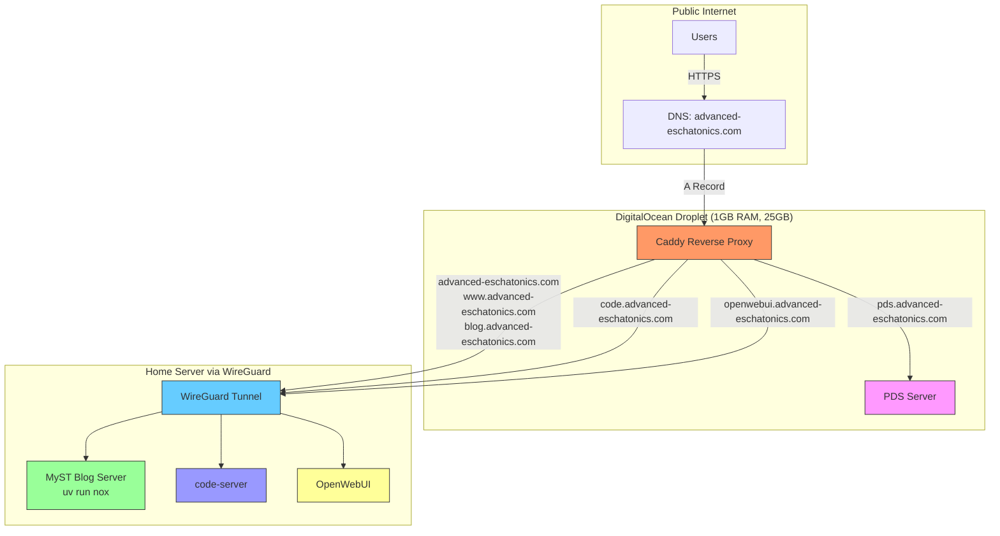

# Resurrection

Here are the steps I finally figured out for getting my account's service endpoint changed from advanced-eschatonics.com to pds.advanced-eschatonics.com. I was inspired by whtwnd and how they use my pds to log me in. I also am the head of AI Rearch and Development at a startup and a lot of what I do is getting software running at app-name.startup.com. 


```bash
goat account plc request-token
curl -s http://localhost:8025/api/v2/messages | jq -r '.items[0].Content.Body'
# Find code, export CODE=<found code>
goat account plc current > unsigned.json
# SUPER IMPORTANT 
nano unsigned.json
# Change serviceEndpoint from advanced-eschatonics.com to pds.advanced-eschatonics.com
# save and exit ctrl + o, ctrl + x
goat account plc sign --token $CODE unsigned.json > signed.json
goat account plc submit signed.json
```


So I'm working on setting up something similar with an oauth proxy that redirects to my PDS the same way whtwnd did it so I can host my own suite of apps at advanced-eschatonics.com. It's already begun. The first app is pds.advanced-eschatonics.com, the app that's going to let me secure the other ones like code and eventually mail. It also frees up advanced-eschatonics.com for my website, which is mostly going to be a personal site for now, but who knows? I do sort of want to host my own bsky viewer app like deer.social but at something like deer.advanced-eschatonics.com. Sky is the limit. How much do I want to run on my infrastructure at home?


:::{figure} ../images/advanced-infrastructure.png
Navigating the space of design decisions and self-hosting capabilities
:::

Because oh yeah I've got wireguard set up. I don't even need to run things on the droplet and shouldn't. I should route traffic to my home box.

I know it's a whole can of worms but with AI accelerating how easy it is to do things in tech I think there are going to be more and more people who want to move outside the tech ecosystem we're trapped in by simple things like spam filters and site reputation.

Most of the weekend my site was down, but I spent all weekend on social media hahahaha. See that's cool. And yeah I save all my posts to the PDS. I do like that about whtwnd even if my plan right now is to long form post on my own website instead of whtwnd. Dammit. Using code to edit my own website that I'm hosting on my droplet is just like the even more developer-y version of what I'm doing now, which is writing my journal in vs code and pushing it with github actions.

I planned at first to insert the codemirror editor I put together for myst with it's preview and project capabilities into whtwnd, then I realized I can basically get the same thing with vs code and myst start and said fuck it, let's focus on the infra.

And I did. I got a shitload done today and yesterday. Whatever things I want to kick my ass about not doing whether it's math or robotics or working out or fucking more I have to give myself a pass for the past couple of days. I've been moving mountains.


# Back from the dead


So my deer account is back. I don't like calling it bluesky. I hate hate HATE the butterfly logo.

I didn't miss posting. I think I posted like twice from my bsky hosted pds alt. There are a bunch more people that follow me over there, and I'm still somehow collecting followers lmao. Whatever!

I know a whole lot more about hosting websites and setting up tunnels and stuff than I did this time last week. And wayland and xrandr and and and...ahhaha

When [this post][test] went through I cheered. New dawn. Temples everywhere for those with eyes to see.

But yeah.


# Blender update

I did open up the STL meshes at the same time in blender and it was less impossible than FreeCAD to view them at the same time, but I still haven't figured out how to get scale working yet. Suppose it's time to watch some youtube videos. Dammit!!


# Holy fucking shit!

So yeah I might want to figure out a way to stage this somewhere else, then build an apply. I really could serve this with a npm serve on the static files form the pds. It's a static site. Having it update in real time live like this is pretty fucking wild.


So yeah all that shit I was talking about code.advanced-eschatonics and openwebui.advanced-eschatonics and pds.advanced-eschatonics? Well.... so I did it. I generated obscenely long passwords for the services and left them open for now. I'll figure out how to put them behind OICD or an oauth proxy with caddy sooner or later.

Well fuck me! I have a homelab! God damn! The idea I'll be able to log in to my home machine from anywhere is kind of daunting. Thus the obscenely long passwords.


# `homelab`

So I am posting long form over here folks. I do wish I had this interacting with my pds. I should take the time to create my own longform blog like whtwnd but form jupyter book projects.




Started out as a vision last week. Now we're there. Only 23:19 on a Sunday evening! Hahahahaha ready for my weekend now that I've done the job I've been putting off for forever.


```
graph LR
    subgraph "Public Internet"
        internet-->droplet["DigitalOcean Droplet"]
    end

    subgraph "Home Server"
        homeServer["Home Server\n(1GB RAM/25GB)"]--wireguard-->"WireGuard Tunnel"
        homeServer--caddy-->"Caddy Reverse Proxy"
    end

    subgraph "Services"
        pds["PDS\n(pds.advanced-eschatonics.com)"]
        blog["Blog/Website\n(advanced-eschatonics.com)"]
        coder["Coder Server\n(code.advanced-eschatonics.com)"]
        openwebui["OpenWebUI\n(openwebui.advanced-eschatonics.com)"]
    end

    droplet--reverseProxy-->"Caddy Reverse Proxy"
    "Caddy Reverse Proxy"--https-->homeServer
    homeServer--serviceRouting-->pds
    homeServer--serviceRouting-->blog
    homeServer--serviceRouting-->coder
    homeServer--serviceRouting-->openwebui
```

[test]: https://deer.social/profile/did:plc:6amf2dzllh6lvnsqxsr4nf6e/post/3luxtfidmnk2f