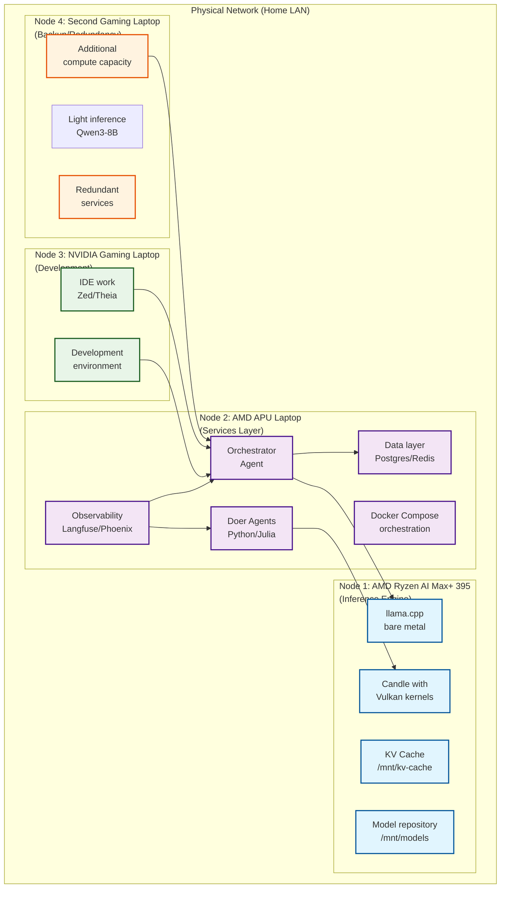
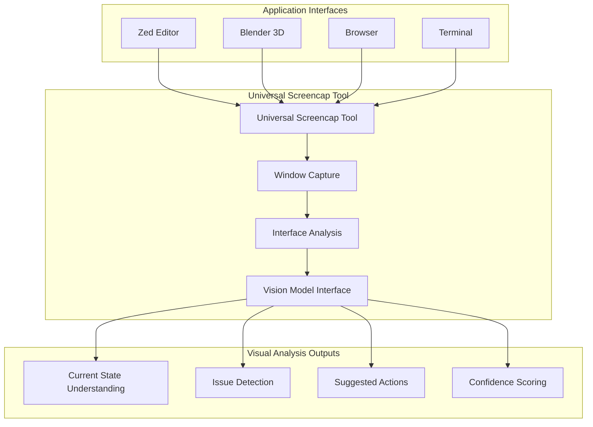
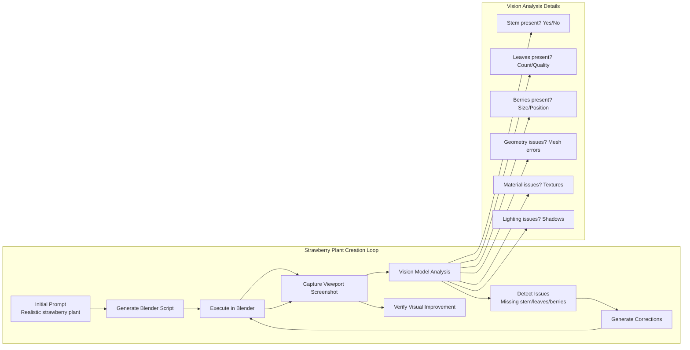
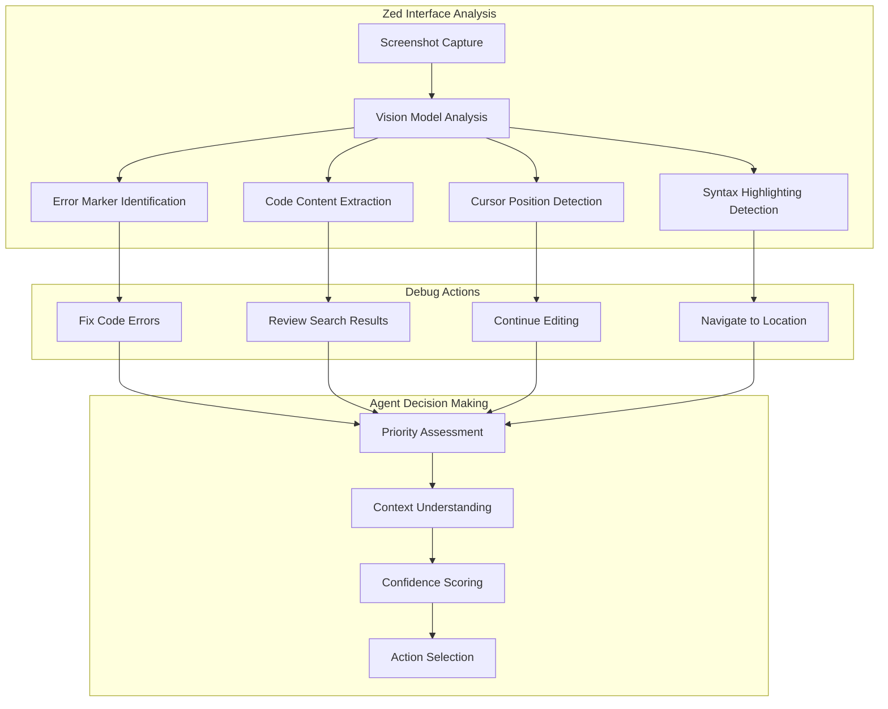
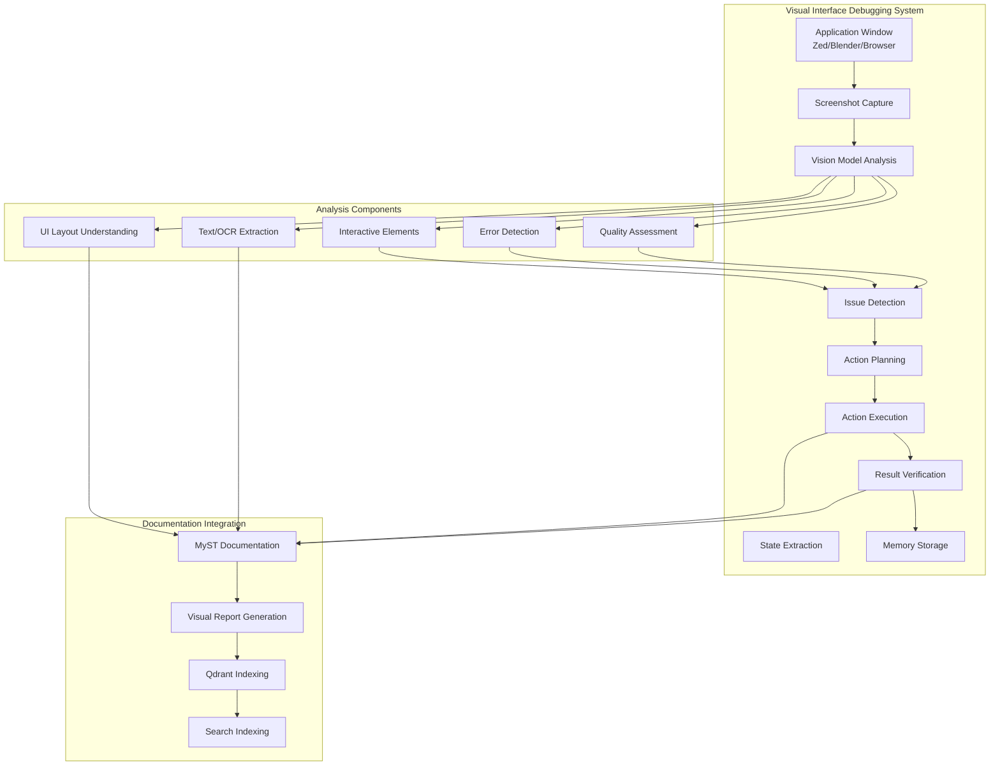
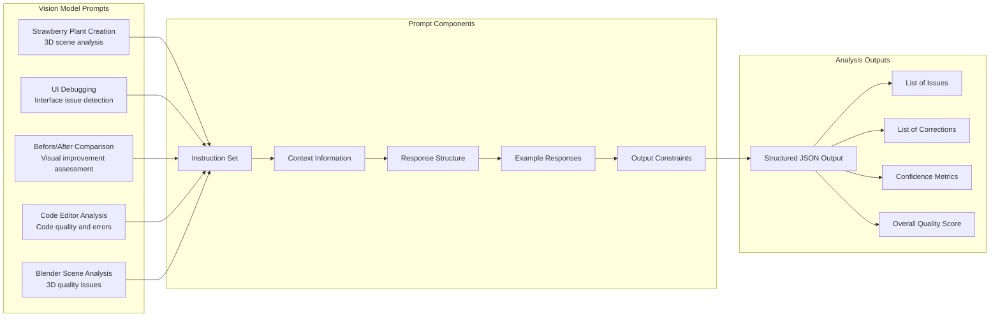
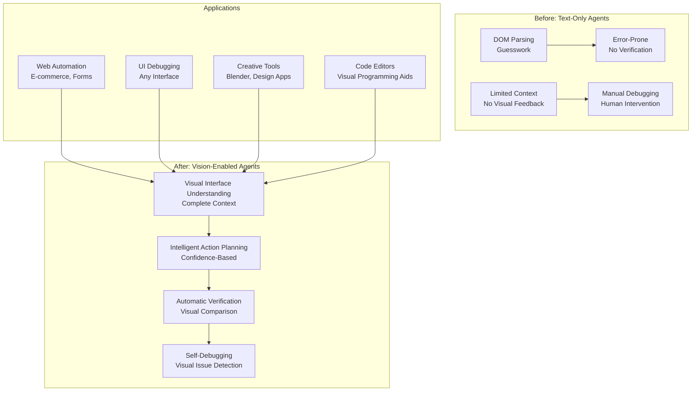

:::{figure} ../images/amd-ryzen-ai-max-plus-395.jpg
This thing is making me fucking work too damn hard
:::

# Statement of Purpose

# Statement of Purpose

All of this work is fundamentally about **building a self-improving AI development ecosystem**. I'm not just keeping this thing running like a top - I'm creating an autonomous system that can process a massive backlog of projects, execute them with AI agents, and document the entire journey. The goal is a fully autonomous development pipeline where:

1. **Backlog Processing**: A queue of projects/tasks that the orchestrator processes continuously
2. **Autonomous Execution**: Doer agents execute tasks with minimal human intervention
3. **Documentation Integration**: MyST automatically generates documentation from agent work
4. **Memory & Search**: Qdrant indexes all work product for retrieval and learning
5. **Continuous Improvement**: The system learns from past work and improves future execution

Every line of code, every system component, every architectural decision is aimed at creating a robust, maintainable, and self-improving platform that can operate autonomously while producing high-quality documentation and searchable knowledge artifacts.

Today (and really the last few days) has been an exercise in extreme context switching and tackling some of the most complex problems in the AI development stack. I've been trying to build everything from the model layer up to the IDE layer, which is either ambitious or completely insane - I haven't decided which yet.

## The Great Qwen3-Coder-30B Debacle

Started today chasing what I thought was a fundamental flaw in Qwen3-Coder-30B's capabilities. The agent was performing terribly, responses were weak, and tool calling was barely working. Spent hours debugging what I assumed were:

- Resource constraints running dual models
- Fundamental reasoning limitations

**WRONG.**

The entire problem was a broken chat template in llama.cpp. A simple configuration issue was making the model appear fundamentally incapable, when in reality it works great in LM Studio. This is what happens when you dive so deep into system internals you forget about how it worked with lmstudio and that the only reason I'm fucking with llama-server and building my own damn openai compliant server on top of llama-cpp-python is because lm-studio evicts my fucking kv cache religiously. Lesson learned: always verify the simple stuff before blaming the complex parts and remember what you already know.

## llama.cpp Deep Dive: KV Caching and Persistence

Once I figured out the issue was from the chat template, I had the agent do some analysis on how to make llama.cpp more efficient with a **persistent** KV cache:

**Investigated persistent KV cache between sessions:**
- Resource needs analysis (RAM requirements scaling with context size)
- Performance implications of cache warmup vs cold start
- Database systems for storing/retrieving KV cache state
- Trade-offs between speed and memory usage

This is crucial for building a responsive IDE that doesn't have to recompute everything from scratch on every interaction. The numbers are staggering - a 30B model context can consume hundreds of GB of RAM, so getting this right matters.

## Multi-Agent Architecture Breakthrough

The most exciting discovery today was building a working prototype of LLMs talking to themselves:

**Built a self-talk test where an LLM changes roles as it goes back and forth:**
```python
# Simplified version of the pattern I discovered
def self_conversation_loop(initial_prompt, max_turns=5):
    messages = [{"role": "user", "content": initial_prompt}]

    for i in range(max_turns):
        # Agent 1 speaks
        response1 = llm_call(messages, role="assistant")
        messages.append({"role": "assistant", "content": response1})

        # Switch to Agent 2 perspective
        messages.append({"role": "user", "content": "Now respond from the perspective of a reviewer"})
        response2 = llm_call(messages, role="assistant")
        messages.append({"role": "assistant", "content": response2})

        # Continue the conversation...
```

This is **exactly** the pattern I want for the doer/orchestrator agent communication. The cross-talk happens naturally by changing message roles and context, which is way more elegant than I initially planned.

## IDE Development: Zed vs Theia Analysis

Spent significant time analyzing the IDE landscape:

**Zed Analysis:**
- Pros: Excellent performance, great UX, active development
- Cons: Less customizable, more opaque architecture
- Approach: Build on top of Zed, extend its capabilities

**Theia Analysis:**
- Pros: Fully customizable, Eclipse foundation, browser-based
- Cons: More complex, heavier resource requirements
- Approach: Fork and customize for AI development needs

**Current leaning:** Start with Zed for faster iteration, have Theia as the long-term customizable solution. The performance difference matters for AI tooling.

## Systems Programming Deep Dive: Vulkan in Rust

Decided to really understand GPU compute by implementing a working Vulkan kernel:

**Built a complete example using ash and vk-mem:**
- Memory management with vk-mem
- Shader compilation and pipeline setup
- Buffer management and data transfer
- Synchronization and command buffer recording

This wasn't just academic - I need to understand how to make AI tooling GPU-accelerated at the systems level. The Rust/Vulkan stack gives me control over the entire pipeline, which is exactly what I need for custom AI tooling.

## Tool Calling System Poisoning

The chat template issue wasn't just about model performance - it completely broke tool calling. The agent couldn't reliably detect when to use tools or how to format tool responses. This cascaded into:

- Drastically reduced agent capabilities
- Poor tool execution success rates
- Confused state management
- Overall system degradation

Fixing this single issue dramatically improved the entire agent stack, which shows how foundational system components affect everything built on top.

## MLIR and Candle-Melior Kernels Exploration

Looking at ways to unify the different backends in candle using MLIR:

- **Goal:** Create a unified intermediate representation that can target multiple backends (CPU, GPU, specialized AI hardware)
- **Approach:** Use MLIR's modular compilation pipeline
- **Benefit:** Write computations once, deploy everywhere
- **Status:** Early exploration, but promising for long-term maintainability

This is the kind of infrastructure work that doesn't show immediate results but will pay huge dividends when we need to support different deployment environments.

## The "Boil the Ocean" Problem

Looking at all this work, I realize I'm trying to build:

1. **Model Layer:** LLM system internals, optimization, tool calling
2. **Agent Layer:** Multi-agent communication, orchestration, task management
3. **Tool Layer:** IDE integration, GPU acceleration, specialized kernels
4. **Infrastructure Layer:** Database systems, MLIR backends, resource management
5. **User Layer:** IDE development, UI/UX, interaction patterns

This is essentially building a complete AI development environment from scratch. The scope is enormous, but the pieces are starting to fit together in interesting ways.

## Key Insights from the Chaos

1. **System fundamentals matter more than you think** - A broken chat template can make a great model look terrible
2. **Cross-agent communication can be elegantly simple** - Role switching in message context works surprisingly well
3. **Performance is non-negotiable** - GPU acceleration at the systems level is required for responsive AI tooling
4. **Infrastructure choices cascade** - Database systems affect performance, which affects UX, which affects adoption
5. **Context switching is expensive** - Jumping between LLM optimization, IDE development, and systems programming is mentally taxing

## Next Steps (Probably)

1. **Fix the chat template permanently** - No more blaming tools for configuration issues
2. **Integrate the self-talk pattern into agent architecture** - This could be a game-changer for multi-agent systems
3. **Choose Zed or Theia** - Make a decision and start building [leaning zed tbh]
4. **Benchmark the Vulkan kernel** - See how we're doing wrt performance
5. **Document the MLIR exploration** - Before I forget what I learned

The sheer volume of work is overwhelming, but the pieces are starting to connect. The self-talk breakthrough alone might justify weeks of seemingly unrelated exploration. Now I just need to make sure I'm not building everything at once.

## Autonomous Backlog Processing & Documentation System

The real endgame here is **autonomous project execution with integrated documentation**. The orchestrator isn't just coordinating agents - it's running a continuous pipeline that processes a backlog of projects while automatically documenting everything.

### The Autonomous Loop

```
Project Backlog → Orchestrator → Doer Agent → MyST Documentation → Qdrant Index → Learning
```

**1. Backlog Management**
- Queue of projects/tasks prioritized by urgency/impact
- Dynamic scheduling based on agent availability and resources
- Progress tracking and completion metrics
- Automatic dependency resolution

**2. Autonomous Execution**
- Doer agents pick tasks from the queue
- Execute with tool calling and file manipulation
- Handle errors and retry logic
- Report completion status

**3. MyST Documentation Integration**
- **This is the key**: Every agent action gets automatically documented in MyST format
- Code execution → `eval-rst` blocks with outputs
- File operations → documented with file paths and changes
- Tool usage → recorded as structured data
- Conversations → captured as dialogue blocks

**4. Qdrant Memory & Search**
- All documentation gets vectorized and indexed
- Semantic search over agent work products
- Retrieval for similar past work
- Learning from successful patterns

### Why This Matters

The orchestrator's primary function is **documentation through execution**. When a doer agent:

- **Fixes a bug** → MyST generates a "Bug Fix Analysis" section
- **Implements a feature** → MyST creates "Feature Implementation" documentation
- **Runs experiments** → MyST captures "Experimental Results"
- **Builds infrastructure** → MyST documents "Architecture Decisions"

All of this gets indexed in Qdrant, creating a **searchable knowledge base** of everything the system has done.

### Example Documentation Flow

```python
# Orchestrator pseudo-code
async def process_project(project):
    # 1. Execute with doer agent
    results = await doer_agent.execute(project.plan)

    # 2. Generate MyST documentation
    docs = generate_myst_documentation(
        project=project,
        results=results,
        agent_logs=agent.conversation_history
    )

    # 3. Write to documentation system
    doc_path = write_myst_document(docs)

    # 4. Index in Qdrant for search
    await qdrant.index_document(doc_path, project.tags)

    # 5. Update project status
    await backlog.mark_completed(project.id)
```

### The Vision: Self-Documenting AI Development

This transforms the system from a "tool" to a **self-improving knowledge worker**:

- **Past work is retrievable** via semantic search
- **Documentation happens automatically** - no manual writing required
- **Learning compounds** - successful patterns get reinforced
- **Knowledge persists** across system restarts and agent changes

The orchestrator becomes the **memory and documentation engine** that turns agent execution into a permanent, searchable knowledge base. This is how you scale development work - not by working faster yourself, but by building systems that work while documenting everything they learn.

## Distributed Architecture Vision: From Single Machine to Multi-Node System

As I've been thinking about the infrastructure needs, I realized my current single-machine setup is just the beginning of what this system needs to become. I have four computers in this house, each with different capabilities, and they're begging to be organized into a proper distributed AI development cluster.

### Current Hardware Inventory

**Primary Server: AMD Ryzen AI Max+ 395 (Server Blade)**
- 128GB RAM
- Multiple GPUs (future AI acceleration)
- **Role:** Bare metal inference engine, KV cache storage
- **Status:** Currently unused for display - pure compute power

**Coding Laptop: NVIDIA RTX GPUs (Development Station)**
- 2x NVIDIA 8GB GPUs
- 32GB RAM each
- **Role:** Development environment, light inference (Qwen3-8B)
- **Constraint:** Memory/GPU stress from multiple windows - not for heavy lifting

**SLURM Controller: AMD APU Laptop**
- AMD APU (Vulkan capable)
- **Role:** Docker Compose orchestration, services layer
- **Advantage:** Perfect for containerized services, not resource-intensive

**Second Gaming Laptop: Backup Compute**
- Similar specs to primary coding laptop
- **Role:** Additional compute capacity, redundancy

### Multi-Node Architecture Blueprint



### Service Distribution Strategy

**Inference Services (Node 1 - Bare Metal)**
- **llama.cpp** for Qwen3-Coder-30B execution
- **Candle** with custom Vulkan kernels
- **KV Cache** as shared storage system
- **Model serving** via HTTP API

**Services Layer (Node 2 - Docker Compose)**
- **Orchestrator Agent:** Coordination and routing
- **Doer Agents:** Task execution (Python/Julia containers)
- **Observability:** Langfuse, Phoenix, Jaeger
- **Data Layer:** Postgres, Redis, Qdrant (future)

**Development Layer (Nodes 3 & 4)**
- **IDE work:** Zed/Theia development
- **Light inference:** Qwen3-8B for quick tests
- **Development tools:** Compilers, testing, debugging

### Distributed KV Cache Evolution

Current thinking is moving toward a **distributed cache service** rather than local filesystem storage:

1. **Phase 1:** Local KV cache (current setup)
2. **Phase 2:** Redis-based distributed cache
3. **Phase 3:** Qdrant integration for vector cache
4. **Phase 4:** Multi-node cache synchronization

The goal is to have cache persistence across machine restarts and the ability to share cache state between inference nodes.

### Network and Service Communication

**Internal Service Network:**
```
Agents (Docker) → HTTP API → Inference (Bare Metal)
    ↓                    ↓
Observability (Docker) ← Monitoring Agents
    ↓
Data Layer (Docker)
```

**External Access:**
- Development machines access services via HTTP
- IDE integrations via APIs
- User interfaces via web services

### Why This Architecture Makes Sense

1. **Resource Separation:** Keep inference on dedicated hardware
2. **Development Isolation:** Development machines stay responsive
3. **Service Containers:** Easy scaling and management of agents
4. **Observability Centralized:** All monitoring in one place
5. **Future Growth:** Ready to add more nodes as needed
6. **Cost Efficiency:** Using existing hardware instead of cloud

### Implementation Roadmap

**Phase 1: Services Layer Containerization**
- Set up Docker Compose on AMD APU laptop
- Move orchestrator and doer agents to containers
- Establish bare metal inference communication

**Phase 2: Distributed Services**
- Implement Redis for shared state?
- Add Qdrant for vector storage?
- Set up proper networking between nodes

**Phase 3: Advanced Features**
- Multi-node inference coordination
- Distributed KV caching
- Auto-scaling across machines

**Phase 4: Production Polish**
- Service mesh for reliability
- Advanced monitoring and alerting
- CI/CD for multi-node deployments

This distributed vision transforms the system from a single-machine prototype into a **proper multi-node AI development cluster** - essentially a personal data center for AI agent research and development. The architecture scales from my current needs while providing the foundation for much more ambitious work.

The key insight is that **services should be containerized, but inference should be bare metal** - the perfect hybrid approach for AI infrastructure.

## Universal Visual Interface Debugging

### The Vision Problem for AI Agents

```mermaid
graph TB
    subgraph "Traditional Web Agent (Blind)"
        DOM[Playwright DOM Parser]
        AGENT[Agent Reasoning]
        ACTION[Action Execution]
        RESULT[DOM Manipulation]
    end

    subgraph "Vision-Enabled Web Agent (Seeing)"
        SCREEN[Screenshot Capture]
        VISION[Vision Model Analysis]
        REASON[Visual Reasoning]
        ACTION_V[Visual Action Planning]
        RESULT_V[Interface Understanding]
    end

    DOM --> AGENT
    AGENT --> ACTION
    ACTION --> RESULT

    SCREEN --> VISION
    VISION --> REASON
    REASON --> ACTION_V
    ACTION_V --> RESULT_V
```



### Universal Screencap Tool Architecture



### Vision-Enabled 3D Creation (Blender Example)



### Zed Editor Visual Debugging



### Visual Feedback Loop for Any UI



### Visual Prompting Architecture



### The Impact: From Text Processing to Visual Intelligence



The screencap tool + vision model combination transforms AI agents from **blind text processors** into **visual assistants** that can understand, debug, and manipulate any graphical interface. This universal visual debugging capability is essential for:
- **End-to-end UI testing** across any application
- **Visual content creation** with tools like Blender
- **Intelligent interface debugging** in code editors
- **Automated visual verification** of work products

The key insight: **vision models give agents eyes** - enabling them to see what they're working with and understand the visual consequences of their actions.
