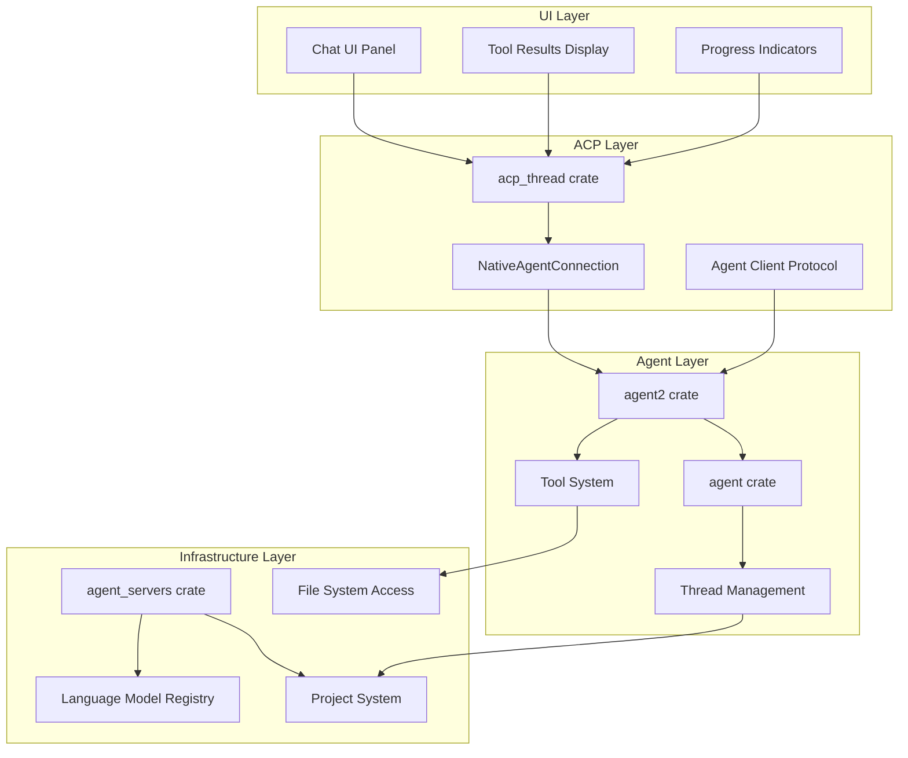
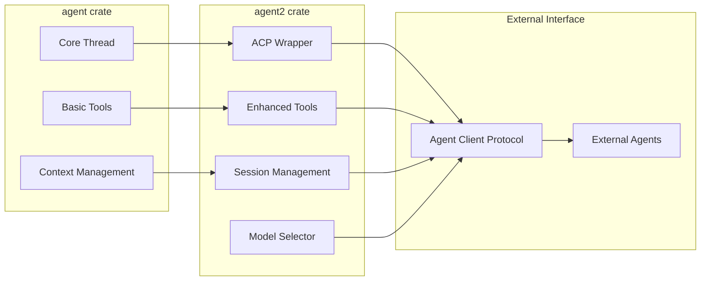
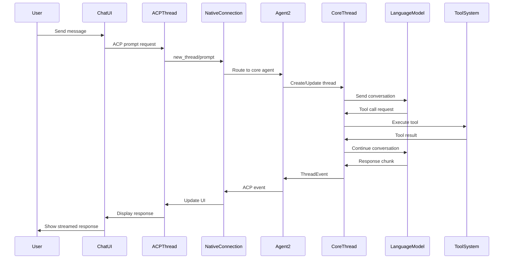
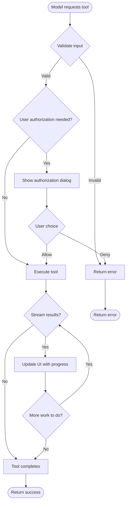
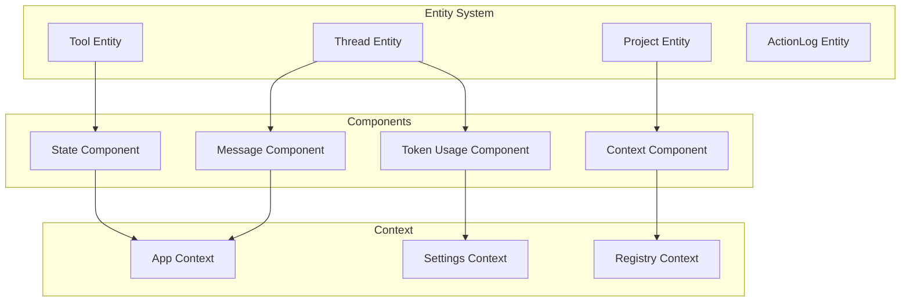
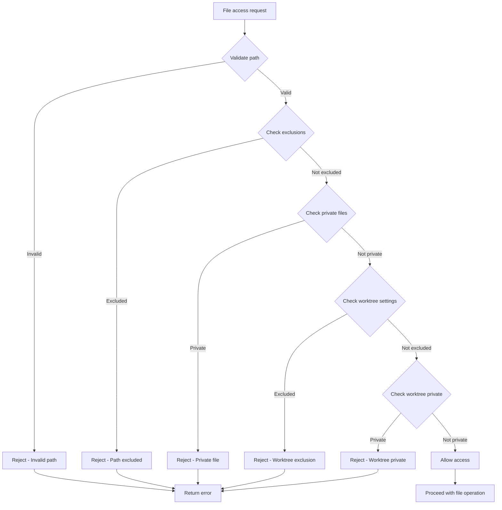
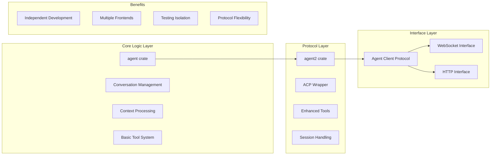
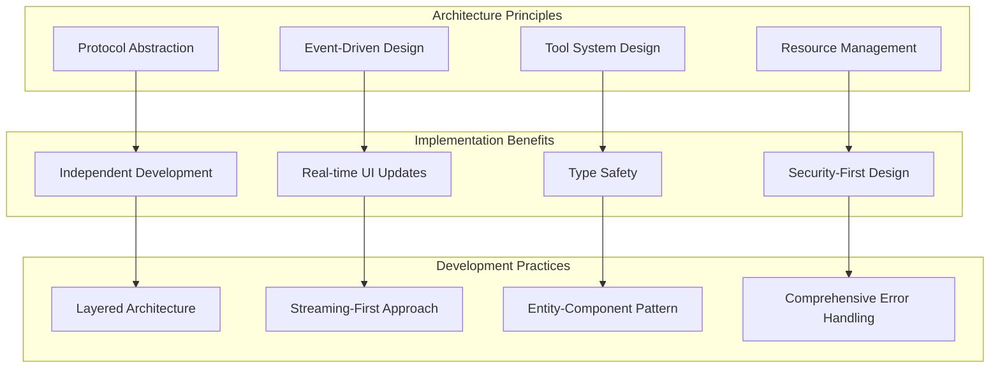

# Deep Dive: Zed's Agent Architecture - How agent2 Wraps agent for ACP Integration

I've been investigating the Zed codebase to understand how their agent system works, and I discovered a fascinating architectural pattern that's worth documenting. If you've ever wondered how Zed's AI chat system works under the hood, this post is for you.

## The Core Insight: agent2 is an ACP Wrapper

The key discovery is that **`agent2` is indeed a wrapper over `agent` that converts it into an ACP (Agent Client Protocol) Agent for the chat system**. This is a beautiful example of architectural layering that separates concerns while maintaining clean interfaces.

### Architecture Overview

Zed's agent system is built around a sophisticated multi-layered architecture:



1. **`agent` crate** - Core agent logic and conversation management
2. **`agent2` crate** - ACP wrapper and enhanced tool system
3. **`acp_thread` crate** - ACP protocol implementation
4. **`agent_servers` crate** - External agent connectors

## How agent2 Wraps agent

The relationship is elegantly simple:

```rust
// From agent2/src/agent2.rs
pub use agent::*;
```

The `agent2` crate re-exports everything from the `agent` crate, making it a direct superset. The key difference is that `agent2` adds:

1. **ACP Interface Implementation**: Wraps core agent logic with ACP-compatible interfaces
2. **Enhanced Tool System**: Provides a more sophisticated tool framework
3. **Session Management**: Handles ACP session lifecycle
4. **UI Integration**: Bridges the gap between agent logic and chat UI



### The ACP Connection Bridge

The `NativeAgentConnection` struct is the key bridge between the core agent and the ACP protocol:

```rust
/// Wrapper struct that implements the AgentConnection trait
#[derive(Clone)]
pub struct NativeAgentConnection(pub Entity<NativeAgent>);

impl acp_thread::AgentConnection for NativeAgentConnection {
    fn new_thread(...) -> Task<Result<Entity<acp_thread::AcpThread>>> {
        // Creates a new thread using the underlying agent
    }

    fn prompt(...) -> Task<Result<acp::PromptResponse>> {
        // Handles ACP prompt requests and routes them to the agent
    }

    fn model_selector(...) -> Option<Rc<dyn AgentModelSelector>> {
        // Provides model selection capabilities
    }
}
```

## Core Architecture Components

### 1. Thread Management

The core conversation logic lives in `agent/src/thread.rs`, which manages:

- **Message History**: Stores conversation turns with user/assistant messages
- **Token Usage**: Tracks and limits token consumption
- **Tool Execution**: Manages tool calls and results
- **Model Integration**: Handles language model interactions
- **Context Management**: Manages project context and file inclusion

### 2. ACP Thread Protocol

The `acp_thread` crate implements the Agent Client Protocol:

```rust
pub struct AcpThread {
    title: String,
    entries: Vec<AgentThreadEntry>,
    plan: Plan,
    project: Entity<Project>,
    action_log: Entity<ActionLog>,
    // ... more fields
}
```

Key features:
- **Unified Interface**: Provides a consistent interface for different agent types
- **Tool Call Support**: Handles tool execution with proper status tracking
- **Content Blocks**: Supports text, images, resource links, and terminal output
- **Event System**: Emits events for UI updates

### 3. Enhanced Tool System

The `agent2` crate provides a sophisticated tool framework through the `AgentTool` trait:

```rust
pub trait AgentTool
where
    Self: 'static + Sized,
{
    type Input: for<'de> Deserialize<'de> + Serialize + JsonSchema;
    type Output: for<'de> Deserialize<'de> + Serialize + Into<LanguageModelToolResultContent>;

    fn name() -> &'static str;
    fn description(&self) -> SharedString;
    fn kind() -> acp::ToolKind;
    fn run(self: Arc<Self>, input: Self::Input, event_stream: ToolCallEventStream, cx: &mut App) -> Task<Result<Self::Output>>;
}
```

#### Built-in Tools

Zed provides a comprehensive set of tools:

- **File Operations**: `ReadFileTool`, `EditFileTool`, `CreateDirectoryTool`, etc.
- **Search**: `GrepTool`, `FindPathTool`
- **Terminal**: `TerminalTool` for shell commands
- **Web**: `WebSearchTool`, `FetchTool`
- **System**: `NowTool`, `DiagnosticsTool`

Each tool implements proper error handling, security checks, and integration with the project system.

```mermaid
graph TB
    subgraph "Tool Categories"
        FileTools[File Operations]
        SearchTools[Search Tools]
        TerminalTools[Terminal Tools]
        WebTools[Web Tools]
        SystemTools[System Tools]
    end

    subgraph "File Operations"
        ReadFile[ReadFileTool]
        EditFile[EditFileTool]
        CreateDir[CreateDirectoryTool]
        DeletePath[DeletePathTool]
        MovePath[MovePathTool]
        CopyPath[CopyPathTool]
    end

    subgraph "Search Tools"
        Grep[GrepTool]
        FindPath[FindPathTool]
        ListDir[ListDirectoryTool]
    end

    subgraph "Terminal Tools"
        Terminal[TerminalTool]
    end

    subgraph "Web Tools"
        WebSearch[WebSearchTool]
        Fetch[FetchTool]
    end

    subgraph "System Tools"
        Now[NowTool]
        Diagnostics[DiagnosticsTool]
    end

    FileTools --> ReadFile
    FileTools --> EditFile
    FileTools --> CreateDir
    FileTools --> DeletePath
    FileTools --> MovePath
    FileTools --> CopyPath

    SearchTools --> Grep
    SearchTools --> FindPath
    SearchTools --> ListDir

    TerminalTools --> Terminal

    WebTools --> WebSearch
    WebTools --> Fetch

    SystemTools --> Now
    SystemTools --> Diagnostics
```



## How It All Works Together

### Chat Interaction Flow



1. **User Input**: User sends a message in the chat UI
2. **ACP Request**: The UI sends an ACP prompt request to `NativeAgentConnection`
3. **Thread Creation**: A new `Thread` is created using the core agent logic
4. **Message Processing**: The message is converted to `UserMessageContent` and added to the thread
5. **Model Request**: The thread sends the conversation to the language model
6. **Tool Execution**: When the model makes tool calls, they're executed via the `AgentTool` framework
7. **Response Streaming**: Results are streamed back through ACP events to the UI

### Tool Execution Flow



```rust
// Simplified tool execution flow
1. Model requests tool call with input
2. NativeAgentConnection receives the request
3. Routes to appropriate AgentTool implementation
4. Tool executes with proper error handling and security checks
5. Results are streamed back through ToolCallEventStream
6. UI updates in real-time with tool progress and results
```

## Key Design Patterns

### 1. Event-Driven Architecture

The system uses an event-driven pattern with `ThreadEvent`:

```rust
pub enum ThreadEvent {
    UserMessage(Message),
    AgentText(String),
    AgentThinking(String),
    ToolCall(ToolCall),
    ToolCallUpdate(ToolCallUpdate),
    Retry(RetryStatus),
    Stop(StopReason),
    // ... more events
}
```

### 2. Streaming Architecture

All interactions use streaming for real-time updates:

- **Model Streaming**: Responses stream as they're generated
- **Tool Streaming**: Tool progress and results stream during execution
- **Event Streaming**: UI updates in real-time via event streams

### 3. Entity-Component System

Uses GPUI's entity system for managing state:



- **Entities**: Long-lived objects (Thread, Project, Tool)
- **Components**: Data and behavior attached to entities
- **Context**: Shared state and dependencies

## Security and Safety

### 1. File Access Control

Tools implement strict security checks:



```rust
// From ReadFileTool
// Error out if this path is either excluded or private in global settings
let global_settings = WorktreeSettings::get_global(cx);
if global_settings.is_path_excluded(&project_path.path) {
    return Task::ready(Err(anyhow!("Cannot read file because its path matches the global `file_scan_exclusions` setting")));
}

if global_settings.is_path_private(&project_path.path) {
    return Task::ready(Err(anyhow!("Cannot read file because its path matches the global `private_files` setting")));
}
```

### 2. Tool Authorization

Tools require user authorization for sensitive operations:

```rust
pub fn authorize(&self, title: impl Into<String>, cx: &mut App) -> Task<Result<()>> {
    if agent_settings::AgentSettings::get_global(cx).always_allow_tool_actions {
        return Task::ready(Ok(()));
    }
    // Shows confirmation dialog to user
}
```

### 3. Resource Limits

The system implements proper resource management:

- **Token Limits**: Tracks and enforces token usage
- **File Size Limits**: Prevents reading overly large files
- **Timeout Handling**: Proper timeout and retry logic
- **Memory Management**: Efficient cleanup of resources

## Integration Points

### 1. External Agents

The `agent_servers` crate supports external agents through ACP:

```rust
pub trait AgentServer: Send {
    fn connect(&self, root_dir: Option<&Path>, delegate: AgentServerDelegate, cx: &mut App)
        -> Task<Result<(Rc<dyn AgentConnection>, Option<task::SpawnInTerminal>)>>;
}
```

This allows integration with Claude Code, Gemini CLI, and other ACP-compatible agents.

### 2. UI Integration

The agent system integrates deeply with Zed's UI:

- **Chat Panel**: Displays conversations with tool results
- **Tool Results**: Shows file diffs, terminal output, and search results
- **Progress Indicators**: Real-time feedback during tool execution
- **Context Completion**: Smart file and symbol inclusion

## Advanced Features

### 1. Project Context Maintenance

The system automatically maintains project context:

```rust
fn maintain_project_context(&self) -> Task<Result<()>> {
    // Monitors project changes and updates context
    // Handles worktree creation/deletion
    // Updates rules files and project settings
}
```

### 2. Model Selection and Management

Supports multiple language models with proper selection:

```rust
impl acp_thread::AgentModelSelector for NativeAgentModelSelector {
    fn list_models(&self, cx: &mut App) -> Task<Result<acp_thread::AgentModelList>> {
        // Lists available models from registry
    }

    fn select_model(&self, model_id: acp::ModelId, cx: &mut App) -> Task<Result<()>> {
        // Updates thread with selected model
        // Persists selection to settings
    }
}
```

### 3. History and Persistence

Conversations are automatically saved and restored:

```rust
// Thread persistence
pub fn serialize(&self, cx: &mut App) -> Result<SerializedThread> {
    // Saves conversation state to disk
}

pub fn deserialize(serialized: SerializedThread, cx: &mut App) -> Result<Entity<Thread>> {
    // Restores conversation from disk
}
```

## Why This Architecture Works

### 1. Separation of Concerns

The clear separation between core agent logic (`agent`) and ACP integration (`agent2`) allows for:



- **Independent Development**: Core logic can evolve without breaking ACP compatibility
- **Multiple Frontends**: The same agent can be used with different protocols
- **Testing Isolation**: Each layer can be tested independently

### 2. Extensibility

The tool system is designed for extensibility:

- **Plugin Architecture**: New tools can be added without modifying core logic
- **Type Safety**: Strong typing ensures tool inputs/outputs are validated
- **Error Handling**: Comprehensive error handling and user feedback

### 3. Performance

The streaming architecture ensures:

- **Real-time Feedback**: Users see progress as tools execute
- **Memory Efficiency**: Large responses are streamed rather than buffered
- **Responsive UI**: The interface remains responsive during long-running operations

## Lessons for Your Own Agent Systems

If you're building your own agent systems, there are several lessons from Zed's architecture:



### 1. Protocol Abstraction

Separate your core agent logic from the communication protocol. This allows you to:
- Support multiple protocols (ACP, WebSocket, HTTP, etc.)
- Change protocols without rewriting core logic
- Test core logic independently of network concerns

### 2. Event-Driven Design

Use events for all state changes:
- Enables real-time UI updates
- Makes debugging easier (you can log all events)
- Supports complex workflows and retries

### 3. Tool System Design

Design your tool system with:
- Strong typing for inputs and outputs
- Comprehensive error handling
- Progress reporting capabilities
- Security boundaries and user authorization

### 4. Resource Management

Implement proper resource management from the start:
- Token usage tracking and limits
- File size restrictions
- Timeout handling
- Memory cleanup

## Conclusion

Zed's agent architecture is a sophisticated, well-designed system that demonstrates several key principles:

1. **Separation of Concerns**: Core logic, ACP integration, and tools are properly separated
2. **Extensibility**: Easy to add new tools and integrate external agents
3. **Safety**: Comprehensive security checks and user controls
4. **Performance**: Streaming architecture and efficient resource management
5. **Consistency**: Unified interfaces and proper state management

The `agent2` crate successfully bridges the gap between the core `agent` logic and the ACP protocol, creating a robust foundation for AI-powered coding assistance in Zed. The system's design allows for both local and remote agent integration while maintaining a consistent user experience.

This architecture provides an excellent blueprint for building your own agent systems, whether you're creating coding assistants, chatbots, or other AI-powered tools. The key takeaway is to think in layers and maintain clean boundaries between your core logic and the interfaces you expose to the outside world.


# Critique

:::{figure} ../images/robot_octopus.png
Peak agentic workflow
:::

## The Agent-Agent Communication Gap

While ACP excels at providing a unified interface for **human-to-agent** communication, it lacks the **agent-to-agent** communication primitives that would enable true multi-agent orchestration.

### The Current Limitation

ACP is fundamentally designed as a **client-server protocol** where:
- **Humans** are the clients
- **Agents** are the servers  
- Communication flows **human → agent** and **agent → human**

But what's missing is the **agent → agent** layer that would enable:
- Agent A to request services from Agent B
- Agent B to delegate specialized tasks to Agent C
- Agents to coordinate on complex multi-step workflows
- Agent composition and chaining

### Why This Matters for Orchestration

Without agent-agent communication, you're limited to:

**Current State (Human-Centric):**
```
Human → Agent A → Tools
Human → Agent B → Tools
Human → Agent C → Tools
```

**Potential State (Agent-Centric Orchestration):**
```
Human → Orchestrator Agent → [Agent A, Agent B, Agent C]
                             ↗        ↗        ↗
                          Agent A → Agent B → Agent C
                          (delegates) (delegates)
```

This is the difference between having multiple independent agents versus having a **cohesive agent ecosystem**.

### The Tool-Based Communication Problem

The current "solution" in Zed is to use tools for inter-agent communication, but this is actually the **core limitation**. As evidenced by the `EditAgent` in `assistant_tools/src/edit_agent.rs`, Zed's approach requires:

1. **Rust Expertise** - You need to understand Rust, Zed's complex architecture, and build systems
2. **Tool Hacking** - To create inter-agent communication, you'd need to hack together custom tools
3. **Long Build Times** - Every change requires rebuilding the entire editor
4. **No Native Agent Discovery** - Agents can't discover or communicate with each other directly

The `EditAgent` is a perfect example - it's a sophisticated editing system, but it's completely isolated. There's no way for your Python agent to call into it, or for it to call out to external agents without writing custom Rust code.

### What's Actually Needed

1. **Native A2A Protocol** - Built-in agent discovery and communication primitives
2. **Agent Registry** - Dynamic registration and discovery of agent capabilities
3. **Cross-Language Support** - Agents written in different languages should interoperate
4. **Tool-Free Communication** - Agents should be able to communicate without writing custom tools

The current approach is like trying to build a phone network by having everyone build their own telephone from scratch.

### The Strategic Opportunity

The lack of agent-agent communication means Zed's agents are powerful individually but can't collaborate as a system. The current tool-based approach creates a **moat around the ecosystem** - it keeps external agents out and makes it incredibly difficult for developers to contribute.

This is the fundamental strategic weakness: Zed has built an excellent agent **platform** but failed to build an agent **ecosystem**. The next step for agent systems isn't just better individual agents - it's **better agent ecosystems** where agents can discover, communicate, and collaborate regardless of the language they're written in.

The irony is that ACP was designed to make it "easy to integrate external agents," but without agent-to-agent communication, those external agents remain isolated islands rather than collaborative partners.

---

*This analysis is based on my investigation of the Zed codebase, particularly the `agent`, `agent2`, `acp_thread`, and `agent_servers` crates. The architecture represents a mature approach to building extensible, secure, and performant AI agent systems.*
